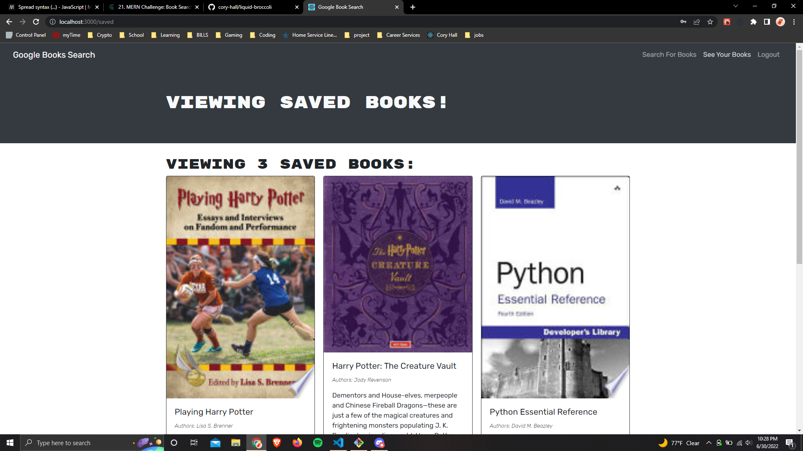

# Liquid Broccoli Book Search Engine

  
  ## Description
  This is a google book search engine. It functions off of the Google Search API.

  ## Technologies Used
  
  
  
  
  
  
  
  

  ## Table of Contents
  - [Installation](#installation)
  - [Usage](#usage)
  - [Tests](#tests)
  - [Questions](#questions)
  - [Credits](#credits)
  - [License](#license)

  ## Installation
  [Visit here to view](https://liquid-broccoli.herokuapp.com/)

  ## Usage
  There are no required instructions for usage. Simply visit the previous link to view.

  ## Tests
  There are no testing features (yet) included with this app.

  ## Screenshot
  </img>

  ## Questions
  Any questions can be directed at the primary author via:  
  [GitHub](https://github.com/cory-hall)  
  [Contact Me!](mailto:cory.c.hall@gmail.com)

  ## Credits
  Cory Hall

  ## License
  Copyright 2022 Cory Hall

        Permission is hereby granted, free of charge, to any person obtaining a copy of this 
        software and associated documentation files (the "Software"), to deal in the Software 
        without restriction, including without limitation the rights to use, copy, modify, 
        merge, publish, distribute, sublicense, and/or sell copies of the Software, and to 
        permit persons to whom the Software is furnished to do so, subject to the following 
        conditions:
        
        The above copyright notice and this permission notice shall be included in all 
        copies or substantial portions of the Software.
        
        THE SOFTWARE IS PROVIDED "AS IS", WITHOUT WARRANTY OF ANY KIND, EXPRESS OR IMPLIED, 
        INCLUDING BUT NOT LIMITED TO THE WARRANTIES OF MERCHANTABILITY, FITNESS FOR A PARTICULAR 
        PURPOSE AND NONINFRINGEMENT. IN NO EVENT SHALL THE AUTHORS OR COPYRIGHT HOLDERS BE LIABLE 
        FOR ANY CLAIM, DAMAGES OR OTHER LIABILITY, WHETHER IN AN ACTION OF CONTRACT, TORT OR 
        OTHERWISE, ARISING FROM, OUT OF OR IN CONNECTION WITH THE SOFTWARE OR THE USE OR OTHER 
        DEALINGS IN THE SOFTWARE.
